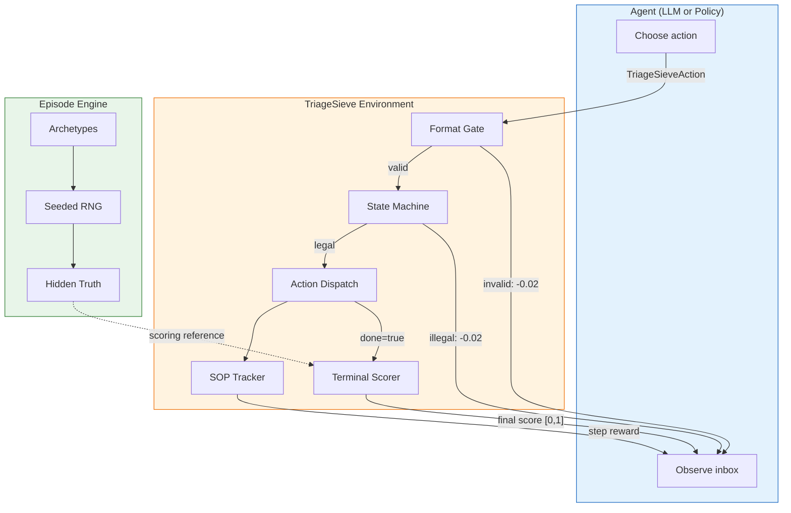
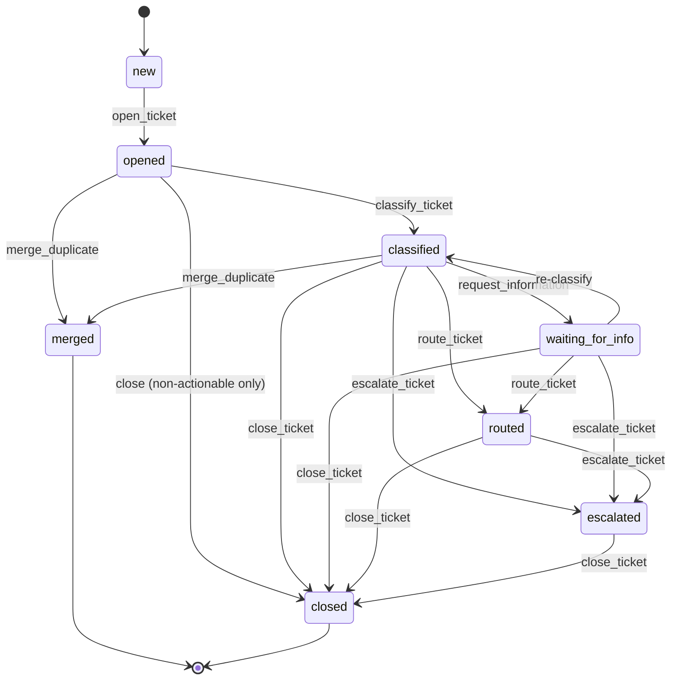

# TriageSieve-OpenEnv

A deterministic, stateful **support-ticket triage environment** built on the [OpenEnv](https://github.com/meta-pytorch/OpenEnv) framework for training and evaluating AI agents on real-world customer support workflows.

The agent plays the role of a tier-1 support engineer: it reads a live inbox of 1-4 tickets, inspects each one, classifies the issue type, assesses business impact and urgency, requests missing information from customers, routes tickets to the correct support queue, and closes them with the appropriate resolution template. Every decision is scored programmatically against hidden ground truth using an 8-component terminal business score, SOP path adherence (UJCS), and episode-level penalty tracking.

---

## Architecture



## Ticket Lifecycle (State Machine)



## Scoring Formula

```mermaid
flowchart LR
    subgraph Terminal["Terminal Business Score (max 0.85)"]
        direction TB
        C1["Classification 0.15"]
        C2["Impact/Urgency 0.15"]
        C3["Queue Routing 0.20"]
        C4["Missing Info 0.10"]
        C5["Escalation 0.10"]
        C6["Dup/Non-actionable 0.05"]
        C7["Template Choice 0.05"]
        C8["Terminal Status 0.05"]
    end

    subgraph UJCS["UJCS (max 0.15)"]
        U1["SOP checkpoints visited"]
        U2["Checkpoints missed"]
        U3["Normalized to 0-1"]
    end

    subgraph Penalties["Episode Penalties"]
        P1["Invalid action: -0.03"]
        P2["Reassignment: -0.05"]
        P3["Unnecessary escalation: -0.05"]
        P4["SLA mishandling: -0.05 to -0.10"]
    end

    Terminal -->|"+ 0.15 x"| UJCS
    UJCS -->|"minus"| Penalties
    Penalties --> Final["Final Score clamp 0 to 1"]

    style Terminal fill:#e8f5e9,stroke:#2e7d32
    style UJCS fill:#e3f2fd,stroke:#1565c0
    style Penalties fill:#ffebee,stroke:#c62828
    style Final fill:#fff9c4,stroke:#f57f17
```



---

## Task Description

Each episode presents the agent with a support inbox. The agent must triage every ticket by following the correct Standard Operating Procedure (SOP) for its issue type. Ground truth (issue family, correct queue, urgency, customer tier, etc.) is hidden from the agent - it must infer these from visible ticket content.

### Difficulty Tiers

| Tier | Tickets | Budget | Challenge |
|------|---------|--------|-----------|
| **Easy** | 1 | 6 steps | Single-path SOP; straightforward classification and routing |
| **Medium** | 2-3 | 12 steps | Mixed issue types; SLA-sensitive tickets; possible duplicates |
| **Hard** | 3-4 | 14 steps | Urgent/security ticket + enterprise SLA; merge candidates; non-actionable distractors; gated-queue prerequisite chains |

Hard episodes are intentionally budget-constrained relative to a perfect oracle solution - partial completion is by design, testing the agent's ability to prioritize.

---

## Action Space

The agent submits a `TriageSieveAction` tagged union discriminated by `action_type`:

| Action | Required Fields | Purpose |
|--------|----------------|---------|
| `open_ticket` | `ticket_id` | Load full ticket detail into focused view |
| `classify_ticket` | `ticket_id`, `issue_family`, `issue_subtype` | Label the issue type (5 families x 3 subtypes = 15 categories) |
| `set_impact_urgency` | `ticket_id`, `impact`, `urgency` | Assess business scope and time sensitivity |
| `route_ticket` | `ticket_id`, `queue_id` | Send to one of 9 support queues |
| `request_information` | `ticket_id`, `requested_fields`, `template_id` | Ask customer for missing data before routing |
| `escalate_ticket` | `ticket_id`, `queue_id`, `reason_code` | Escalate to a higher-tier queue with justification |
| `merge_duplicate` | `ticket_id`, `target_ticket_id` | Merge a duplicate ticket into the original |
| `close_ticket` | `ticket_id`, `close_reason` | Close with reason: resolved, duplicate, non_actionable, feature_request, no_response |
| `skip_turn` | - | No-op; consumes one budget step |
| `finish_episode` | - | Explicitly end the episode early |

Two queues (`tech_support_l2`, `security_team`) are **gated** - attempting to route without meeting prerequisites returns a pushback message and a penalty.

---

## Observation Space

Each step returns a `TriageSieveObservation` containing:

| Field | Description |
|-------|-------------|
| `inbox_summaries` | All tickets with subject, sender, status, customer tier, SLA remaining, preview |
| `focused_ticket` | Full content of the last opened ticket (thread history, attachments, internal notes) |
| `routing_policy_cards` | Queue descriptions with prerequisites and handled issue families |
| `sla_policy_cards` | Customer tier SLA deadlines (response + resolution) |
| `available_templates` | Reply/closure templates the agent can reference |
| `legal_actions` | Actions currently valid given the episode state |
| `action_budget_remaining` | Steps left before forced termination |
| `last_action_result` | `"ok"` or a precise error/pushback message |
| `reward` | Step shaping reward, or the final composite score on the terminal step |
| `done` | Whether the episode has ended |
| `hint` | Guided-mode hint string (only in `train_guided` mode; never affects scoring) |

---

## Baseline Scores

### Scripted Expert (oracle with hidden truth access, seed=42)

| Tier | Score | Threshold |
|------|-------|-----------|
| Easy | **1.000** | >= 0.90 |
| Medium | **1.000** | >= 0.75 |
| Hard | **0.383** | >= 0.20 |

### LLM Baseline Results (no hidden truth access, multi-turn, seed=42)

| Model | Easy | Medium | Hard | Avg |
|-------|------|--------|------|-----|
| Llama-3.3-70B-Instruct | **1.000** | **0.771** | **0.122** | **0.631** |
| Qwen2.5-72B-Instruct | 0.720 | 0.627 | 0.155 | 0.501 |
| DeepSeek-R1 | 0.470 | 0.253 | 0.076 | 0.267 |

Llama-3.3-70B achieves a perfect score on easy and the highest average across all tiers. On hard tasks, all models struggle with budget management — they must process 3-4 tickets in 14 steps, requiring precise action ordering (request info before routing) and prioritization of high-urgency tickets. This validates the difficulty ladder design: hard tasks are genuinely challenging for frontier LLMs without fine-tuning.

---

## Quick Start

### Installation

```bash
# Requires Python >= 3.10
uv sync
# or
pip install -e ".[dev]"
```

### Run the server locally

```bash
uv run server
# or: python -m uvicorn triagesieve_env.server.app:app --reload --port 8000
```

### Connect with the Python client

```python
import asyncio
from triagesieve_env import TriageSieveEnv
from triagesieve_env.models import TriageSieveAction, ActionType

async def main():
    env = TriageSieveEnv(base_url="http://localhost:8000")
    result = await env.reset(seed=42, difficulty="easy", mode="eval_strict")
    obs = result.observation

    ticket_id = obs.inbox_summaries[0].ticket_id
    result = await env.step(TriageSieveAction(
        action_type=ActionType.OPEN_TICKET,
        ticket_id=ticket_id,
    ))
    print(result.observation.focused_ticket.subject)
    await env.close()

asyncio.run(main())
```

### Run the scripted expert baseline

```bash
python scripts/smoke_playthrough.py                    # all tiers, seed=42
python scripts/smoke_playthrough.py --difficulty easy   # single tier
python scripts/smoke_playthrough.py --seed 7 --quiet    # custom seed, no trace
```

### Run the test suite

```bash
python -m pytest tests/ -q                              # all tests (~770)
python -m pytest tests/ -m "not slow" -q                # skip real LLM tests
python -m pytest tests/test_rewards.py -q               # scoring tests only
```

---

## Docker Build and Deployment

### Build and run locally

```bash
docker build -t triagesieve_env .
docker run -p 8000:8000 triagesieve_env
```

### Deploy to Hugging Face Spaces

```bash
openenv validate
openenv push your-username/triagesieve_env
```

The deployed Space exposes:
- `/web` - Interactive web UI
- `/docs` - OpenAPI/Swagger documentation
- `/ws` - WebSocket endpoint for low-latency sessions
- `/health` - Container health check

---

## Running the Inference Script

The `inference.py` script runs an LLM agent against the Dockerized environment, producing structured logs for automated evaluation.

```bash
# Set environment variables
export HF_TOKEN="your-huggingface-token"
export LOCAL_IMAGE_NAME="triagesieve_env"

# Optional (have defaults)
export API_BASE_URL="https://router.huggingface.co/v1"
export MODEL_NAME="Qwen/Qwen2.5-72B-Instruct"

# Build Docker image, then run
docker build -t triagesieve_env .
python inference.py
```

Output follows the required `[START]`/`[STEP]`/`[END]` format:
```
[START] task=easy env=triagesieve_env model=Qwen/Qwen2.5-72B-Instruct
[STEP] step=1 action=open_ticket:T001 reward=0.01 done=false error=null
[STEP] step=2 action=classify_ticket:T001:billing reward=0.02 done=false error=null
...
[END] success=true steps=6 score=1.000 rewards=0.01,0.02,0.01,0.03,0.01,1.00
```

---

## Project Structure

```
triagesieve_env/
    __init__.py                 Package exports
    models.py                   All Pydantic models, enums, and constants
    client.py                   Async EnvClient for HTTP/WebSocket
    inference.py                Hackathon inference script (OpenAI client)
    openenv.yaml                OpenEnv environment manifest
    pyproject.toml              Package metadata and dependencies
    Dockerfile                  Multi-stage Docker build (OpenEnv base)
    server/
        app.py                  FastAPI entrypoint via create_app()
        triagesieve_env_environment.py
                                Core Environment (step/reset/state)
        episode_engine.py       Deterministic episode generation from archetypes
        policy_graph.py         SOP DAG definitions, tracker, UJCS computation
        scorer.py               Terminal scoring, penalties, final score formula
        hint_engine.py          Guided-mode hint generation
    baseline/
        scripted_expert.py      Oracle policy (proves solvability)
        llm_baseline.py         LiteLLM-based agent (no hidden truth)
    data/
        archetypes.json         18 scenario archetypes with SOP graphs
        templates.json          Reply/closure templates
        routing_rules.json      Queue prerequisites and issue family mapping
        sla_rules.json          Customer tier SLA deadlines
        seeded_episodes.jsonl   Pre-generated episode bank (100 episodes)
    scripts/
        generate_episodes.py    Deterministic episode generator CLI
        validate_episode_bank.py
                                Validates parse, determinism, solvability
        smoke_playthrough.py    Runs scripted expert, asserts thresholds
    tests/                      770+ tests (pytest)
```

---

## Research Backing

| Concept | Source |
|---------|--------|
| Ticket categorization and hierarchical labels | [Expert Systems with Applications (2023)](https://www.sciencedirect.com/science/article/pii/S0957417423004864) |
| Priority = f(impact, urgency) matrix | [BMC Remedyforce - Creating Priorities](https://docs.bmc.com/xwiki/bin/view/More-Products/RemedyForce/BMC-Helix-Remedyforce/remforce202502/Administering/Configuring-BMC-Remedyforce/Creating-priorities/) |
| Ticket reassignment as complexity proxy | [Decision Analytics Journal (2022)](https://www.sciencedirect.com/science/article/pii/S2666827021001195) |
| Non-actionable sub-categorization (CORTEX) | [arXiv:2510.00311 (2024)](https://papers.cool/arxiv/2510.00311) |
| UJCS for policy adherence | [JourneyBench (2025)](https://researchtrend.ai/papers/2601.00596) |
| OpenEnv framework | [GitHub](https://github.com/meta-pytorch/OpenEnv) / [Docs](https://meta-pytorch.org/OpenEnv/) |

---

## License

BSD-3-Clause (same as OpenEnv)
